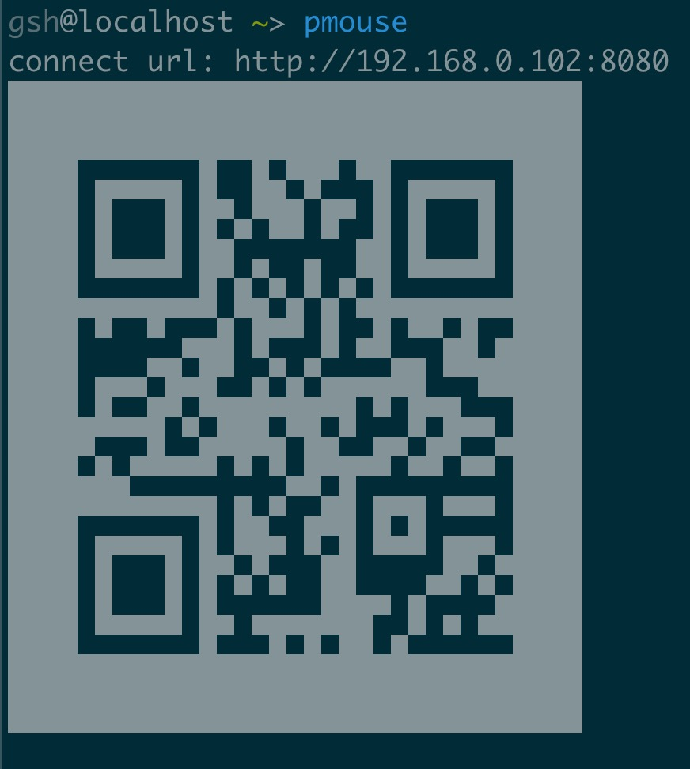

# 介绍

如果你的鼠标坏了，可以用这个软件替代鼠标。



# 安装

```shell
go install github.com/bitmyth/pmouse@latest
```

# 运行

```shell
pmouse
```

手机扫码就可以操作电脑的鼠标移动，点击

# Description

This is a mouse simulator

If your mouse is broken, you can use this software to replace the mouse.

# Install

```shell
go install github.com/bitmyth/pmouse@latest
```

# Run

```shell
pmouse
```

then scan the QR code by your mobile, after that, you can use phone to control the pointer on screen
